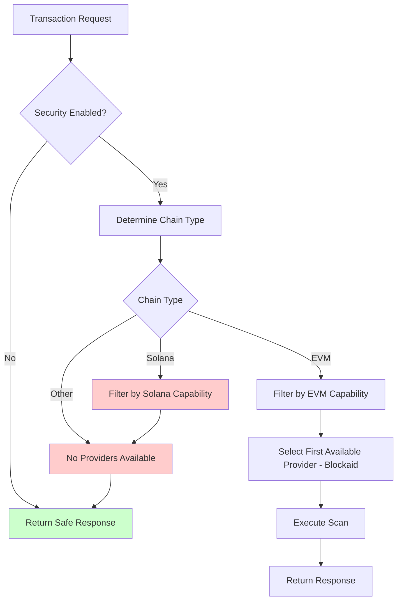
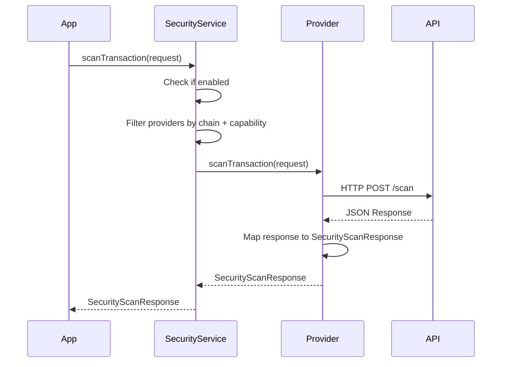
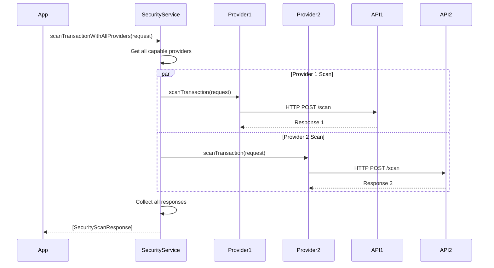

# VultisigApp Security Architecture Documentation

## Overview

The VultisigApp security system provides comprehensive transaction, address, and token scanning across multiple blockchains using pluggable security providers. The architecture is built on polymorphism, allowing multiple security providers to be integrated seamlessly.

## 🏗️ Architecture Components

### Core Protocols

#### `SecurityProvider`
The main interface that all security providers must implement:
```swift
protocol SecurityProvider {
    var providerName: String { get }
    func scanTransaction(_ request: SecurityScanRequest) async throws -> SecurityScanResponse
    func supportsChain(_ chain: Chain) -> Bool
}
```

#### `CapabilityAwareSecurityProvider`
Extended protocol for providers with configurable capabilities:
```swift
protocol CapabilityAwareSecurityProvider: SecurityProvider {
    var capabilities: SecurityProviderCapabilities { get }
}
```

### Core Classes

#### `SecurityService` (Singleton)
- **Purpose**: Main orchestrator that manages multiple security providers
- **Responsibilities**: 
  - Provider management and selection
  - Capability-based routing
  - Transaction/address/token scanning coordination
- **Key Methods**:
  - `scanTransaction(_:)` - Single provider scanning
  - `scanTransactionWithAllProviders(_:)` - Multi-provider scanning
  - `scanToken(_:for:)` - Token security analysis
  - `validateAddress(_:for:)` - Address validation

#### `SecurityServiceFactory`
- **Purpose**: Configures and initializes the security service
- **Pattern**: Factory pattern for clean initialization
- **Configuration**: Environment-based and UserDefaults-based

#### `SecurityProviderCapabilities`
- **Purpose**: Defines what each provider can do
- **Capabilities**:
  - `evmTransactionScanning: Bool`
  - `solanaTransactionScanning: Bool` 
  - `addressValidation: Bool`
  - `tokenScanning: Bool`

## 🔄 Provider Selection Flow



## 🛡️ Current Security Providers

### Blockaid Provider
- **Capabilities**: EVM transaction scanning only
- **Endpoints**:
  - EVM: `/evm/json-rpc/scan`
  - Solana: `/solana/message/scan` (not enabled - requires subscription)
  - Address: `/evm/address/scan`, `/solana/address/scan` (not enabled - requires subscription)
  - Token: `/token/scan` (not enabled - requires subscription)
- **Risk Levels**: Maps Blockaid classifications to app risk levels
- **Current Configuration**:
  ```swift
  static let blockaid = SecurityProviderCapabilities(
      evmTransactionScanning: true,
      solanaTransactionScanning: false, // Not subscribed
      addressValidation: false,         // Not subscribed
      tokenScanning: false             // Not subscribed
  )
  ```

## 📝 Adding a New Security Provider

### Step 1: Create the Provider Class

```swift
// Create your provider class
class MySecurityProvider: CapabilityAwareSecurityProvider {
    let capabilities: SecurityProviderCapabilities
    
    init(capabilities: SecurityProviderCapabilities) {
        self.capabilities = capabilities
    }
    
    var providerName: String {
        return "MyProvider"
    }
    
    func supportsChain(_ chain: Chain) -> Bool {
        switch chain.chainType {
        case .EVM:
            return capabilities.evmTransactionScanning
        case .Bitcoin:
            return capabilities.bitcoinScanning // Add new capabilities as needed
        default:
            return false
        }
    }
    
    func scanTransaction(_ request: SecurityScanRequest) async throws -> SecurityScanResponse {
        // Implement your scanning logic
        // Return SecurityScanResponse with appropriate risk level
    }
}
```

### Step 2: Define Capabilities

```swift
// In SecurityProviderCapabilities.swift
extension SecurityProviderCapabilities {
    static let myProvider = SecurityProviderCapabilities(
        evmTransactionScanning: true,
        solanaTransactionScanning: false,
        addressValidation: true,
        tokenScanning: true,
        bitcoinScanning: true // Add new capabilities
    )
}
```

### Step 3: Register in Available Providers

```swift
// In AvailableSecurityProviders.swift
enum AvailableSecurityProvider: String, CaseIterable {
    case blockaid = "blockaid"
    case myProvider = "myProvider" // Add your provider
    
    var capabilities: SecurityProviderCapabilities {
        switch self {
        case .blockaid:
            return .blockaid
        case .myProvider:
            return .myProvider // Reference your capabilities
        }
    }
    
    func createProvider() -> SecurityProvider? {
        guard isEnabled else { return nil }
        
        switch self {
        case .blockaid:
            return BlockaidProvider(capabilities: capabilities)
        case .myProvider:
            return MySecurityProvider(capabilities: capabilities)
        }
    }
}
```

### Step 4: Update SecurityService (if needed)

```swift
// Add any provider-specific logic in SecurityService.swift
func scanTokenWithCustomProvider(_ tokenAddress: String, for chain: Chain) async throws -> SecurityScanResponse {
    // Provider-specific implementation if needed
    if let myProvider = provider as? MySecurityProvider {
        return try await myProvider.scanToken(tokenAddress, for: chain)
    }
}
```

## 🔧 Configuration & Setup

### Basic Setup
```swift
// In AppDelegate or SceneDelegate
SecurityServiceFactory.configure(with: .default)
```

### Custom Configuration
```swift
let config = SecurityServiceFactory.Configuration(isEnabled: true)
SecurityServiceFactory.configure(with: config)
```

### Environment-Based Configuration
```swift
let config = SecurityServiceFactory.getConfigurationFromEnvironment()
SecurityServiceFactory.configure(with: config)
```

### Provider-Specific Configuration
```swift
// Enable/disable specific providers
UserDefaults.standard.setSecurityProviderEnabled("blockaid", enabled: true)
UserDefaults.standard.setSecurityProviderEnabled("myProvider", enabled: false)
```

## 🚦 Security Scanning Flows

### Transaction Scanning Flow



### Multi-Provider Scanning Flow



## 📊 Risk Level Mapping

### Standard Risk Levels
```swift
enum SecurityRiskLevel: String, CaseIterable {
    case none = "NONE"        // Completely secure, no issues
    case low = "LOW"          // Minor concerns, generally safe
    case medium = "MEDIUM"    // Moderate risk, review recommended
    case high = "HIGH"        // High risk, caution advised
    case critical = "CRITICAL" // Critical risk, do not proceed
}
```

### Provider-Specific Mapping Example (Blockaid)
```swift
private func mapBlockaidValidationToRiskLevel(_ classification: String?, resultType: String?, status: String?, hasFeatures: Bool) -> SecurityRiskLevel {
    // Success + Benign + No Features = Completely Secure
    if status?.lowercased() == "success" && 
       resultType?.lowercased() == "benign" && 
       !hasFeatures {
        return .none
    }
    
    // Map other classifications
    switch classificationToUse.lowercased() {
    case "benign": return .low
    case "warning": return .medium
    case "malicious": return .critical
    case "spam": return .medium
    default: return .medium
    }
}
```

## 🧪 Testing

### Unit Tests
```swift
// Test individual providers
func testMyProviderScanning() async throws {
    let provider = MySecurityProvider(capabilities: .myProvider)
    let request = SecurityScanRequest(/* ... */)
    let response = try await provider.scanTransaction(request)
    
    XCTAssertEqual(response.provider, "MyProvider")
    XCTAssertNotNil(response.riskLevel)
}
```

### Integration Tests
```swift
// Test through SecurityService
func testSecurityServiceWithMyProvider() async throws {
    SecurityServiceFactory.configure(with: .default)
    let service = SecurityService.shared
    
    let request = SecurityScanRequest(/* ... */)
    let response = try await service.scanTransaction(request)
    // Assert expected behavior
}
```

### API Response Tests
```swift
// Test real API responses
func testMyProviderAPIResponse() async throws {
    // Test against real API endpoints
    // Validate response parsing and error handling
}

// Note: Current Limitations
func testSolanaScanning() async throws {
    // This will fail because Solana scanning is not enabled for Blockaid
    let request = SecurityScanRequest(chain: .solana, /* ... */)
    
    do {
        let _ = try await securityService.scanTransaction(request)
        XCTFail("Expected Solana scanning to fail")
    } catch SecurityProviderError.chainNotSupported {
        // Expected: No providers support Solana currently
        print("✅ Correctly handled unsupported Solana chain")
    }
}
```

## 🔍 Debugging & Logging

### Enable Debug Logging
All providers include comprehensive logging:
```swift
private let logger = Logger(subsystem: "my-provider", category: "security")

// Log API requests
logger.info("📤 API REQUEST to \(url):")
logger.info("\(requestJSON)")

// Log API responses  
logger.info("🌐 API RESPONSE:")
logger.info("\(responseJSON)")

// Log risk level mapping
logger.info("🎯 Mapped Risk Level: \(riskLevel.rawValue)")
```

### Common Debug Patterns
```swift
// Check provider selection
logger.info("Available providers for \(chain.name): \(providers.map { $0.providerName })")

// Check capability filtering
logger.info("Providers with EVM capability: \(evmProviders.count)")

// Check scanning results
logger.info("Security scan completed. Risk: \(response.riskLevel.rawValue), Warnings: \(response.warnings.count)")
```

## 📋 Best Practices

### Provider Implementation
1. **Always implement capability checks** in `supportsChain(_:)`
2. **Use comprehensive error handling** with `SecurityProviderError`
3. **Log requests and responses** for debugging
4. **Map risk levels consistently** across providers
5. **Handle network failures gracefully**

### Security Service Usage
1. **Check `isEnabled`** before scanning
2. **Use capability-based provider selection**
3. **Handle provider unavailability** with safe defaults
4. **Consider multi-provider scanning** for critical transactions

### Configuration
1. **Use environment-based configuration** for flexibility
2. **Allow provider-specific enable/disable** 
3. **Provide meaningful defaults**
4. **Document configuration options**

## 🔒 Security Considerations

### API Keys & Authentication
- **Never hardcode API keys** in the code
- **Use secure storage** for sensitive credentials
- **Implement proper authentication** flows
- **Handle authentication failures** gracefully

### Data Privacy
- **Minimize data sent** to external providers
- **Use privacy-preserving techniques** where possible
- **Document data sharing** with external services
- **Provide user control** over data sharing

### Error Handling
- **Never expose sensitive information** in error messages
- **Fail securely** with safe defaults
- **Log security events** appropriately
- **Handle rate limiting** and service unavailability

## 📈 Future Enhancements

### Planned Features
- [ ] **Multi-provider consensus** - Aggregate results from multiple providers
- [ ] **Caching layer** - Cache scan results to reduce API calls
- [ ] **Real-time threat feeds** - Subscribe to threat intelligence updates
- [ ] **Custom rules engine** - Allow custom security rules
- [ ] **Batch scanning** - Scan multiple transactions efficiently

### Provider Expansion
- [ ] **Chainalysis** - Compliance and AML scanning
- [ ] **Blowfish** - Alternative transaction simulation
- [ ] **Custom rules** - User-defined security rules
- [ ] **On-chain analysis** - Direct blockchain analysis

## 🔄 Provider Selection Examples

### EVM Transaction (Supported)
```swift
// When scanning an Ethereum/Arbitrum/BSC transaction:
// 1. SecurityService checks if enabled ✅
// 2. Filters providers by EVM support ✅
// 3. Filters by evmTransactionScanning capability ✅
// 4. Selects Blockaid provider ✅
// 5. Calls scanEVMTransaction() method ✅
// Result: Transaction gets scanned and risk level returned
```

### Solana Transaction (Not Supported)
```swift
// When scanning a Solana transaction:
// 1. SecurityService checks if enabled ✅
// 2. Filters providers by Solana support ❌
// 3. No providers have solanaTransactionScanning capability ❌
// 4. Returns safe response (no scanning performed) ⚠️
// 5. User sees "No security scanning available" message
```

### Adding Solana Support
```swift
// To enable Solana scanning:
// 1. Subscribe to Blockaid Solana scanning service 💰
// 2. Update SecurityProviderCapabilities.blockaid:
static let blockaid = SecurityProviderCapabilities(
    evmTransactionScanning: true,
    solanaTransactionScanning: true, // Enable this
    addressValidation: false,        // Also requires subscription
    tokenScanning: false            // Also requires subscription
)
```

## 📞 Support & Contact

For questions about the security architecture:
- **Code Issues**: Create GitHub issues with `security` label
- **Provider Integration**: Contact the security team
- **API Documentation**: Refer to provider-specific docs

---

**Last Updated**: January 2025  
**Version**: 1.0.0 