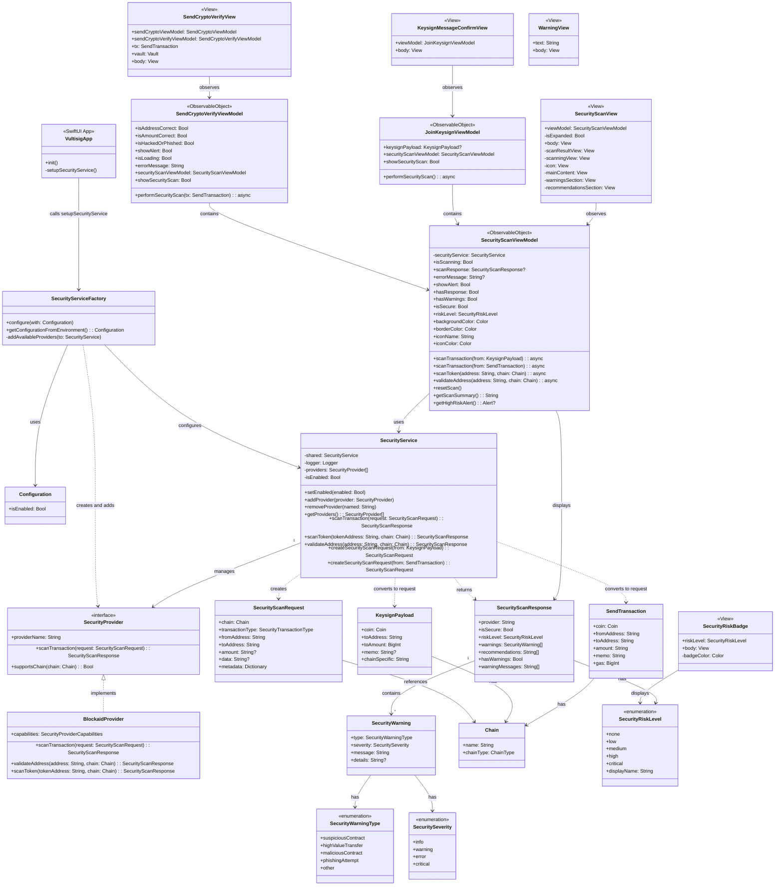

## Architecture Layers:

### 1. **App Layer** (Application Lifecycle)
- **VultisigApp** - Main app entry point that initializes security service on launch
- **SecurityServiceFactory** - Factory pattern for configuring security service with providers

### 2. **Service Layer** (Core Logic)
- **SecurityService** - Main singleton managing security operations
- **SecurityProvider** - Protocol for security providers
- **BlockaidProvider** - Concrete implementation

### 3. **View Model Layer** (Business Logic & State)
- **SecurityScanViewModel** - Main VM handling security scans and UI state
- **SendCryptoVerifyViewModel** - VM for send crypto verification
- **JoinKeysignViewModel** - VM for keysign operations

### 4. **View Layer** (UI Components)
- **SecurityScanView** - Main security scan display component
- **SecurityRiskBadge** - Badge displaying risk level
- **SendCryptoVerifyView** - Send transaction verification screen
- **KeysignMessageConfirmView** - Keysign confirmation screen
- **WarningView** - Generic warning display

### 5. **Model Layer** (Data Structures)
- Request/Response models (SecurityScanRequest, SecurityScanResponse)
- Domain models (KeysignPayload, SendTransaction, Chain)
- Enumerations for type safety

## Key Relationships:

1. **App initializes SecurityService** - VultisigApp configures the security service on launch via SecurityServiceFactory
2. **View Models use SecurityService** - The VMs delegate security operations to the service
3. **Views observe View Models** - SwiftUI's @ObservableObject pattern
4. **SecurityService manages providers** - Plugin architecture for multiple providers
5. **Domain models integrate** - KeysignPayload and SendTransaction are converted to SecurityScanRequest

The architecture follows MVVM pattern with clean separation of concerns, making it easy to add new security providers or UI components.

## Why Configure Security Service at App Launch?

The security service is configured in `VultisigApp.init()` for several important reasons:

1. **Early Initialization** - Security checks need to be available as soon as the app starts, before any transactions can be initiated
2. **Centralized Configuration** - Having a single point of configuration ensures consistency across the entire app
3. **Environment-Based Settings** - The factory pattern allows configuration based on environment variables or user defaults
4. **Provider Registration** - All security providers need to be registered before they can be used, making app startup the ideal time
5. **Performance** - Initializing providers once at startup avoids runtime overhead during critical transaction flows

## Class Diagram

