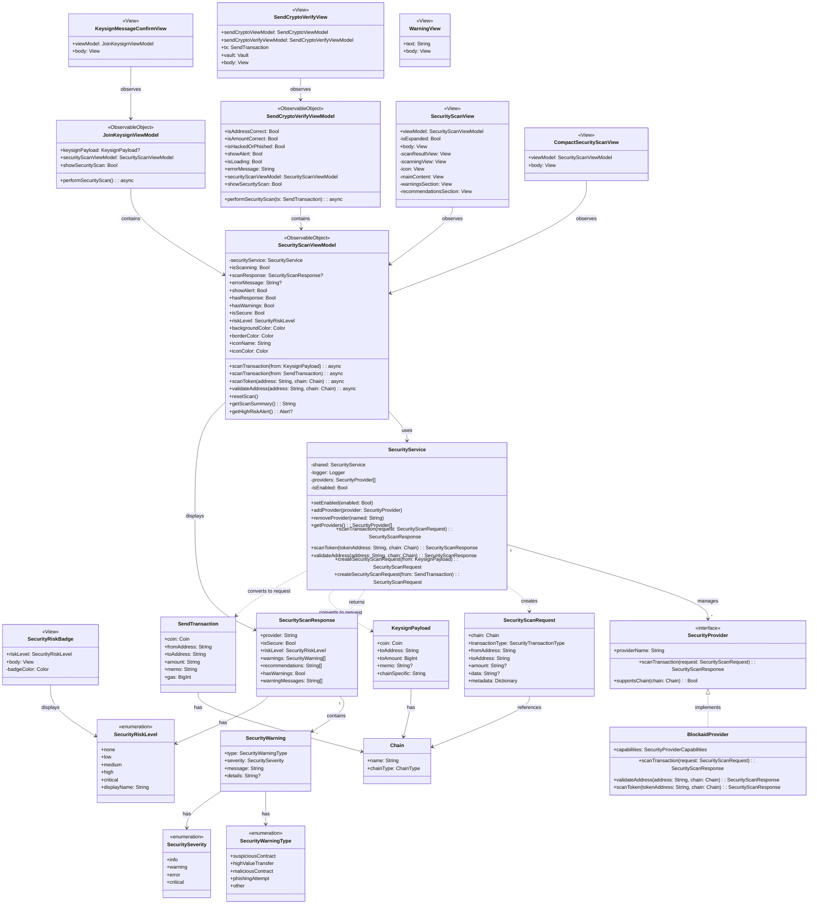

## Architecture Layers:

### 1. **Service Layer** (Core Logic)
- **SecurityService** - Main singleton managing security operations
- **SecurityProvider** - Protocol for security providers
- **BlockaidProvider** - Concrete implementation

### 2. **View Model Layer** (Business Logic & State)
- **SecurityScanViewModel** - Main VM handling security scans and UI state
- **SendCryptoVerifyViewModel** - VM for send crypto verification
- **JoinKeysignViewModel** - VM for keysign operations

### 3. **View Layer** (UI Components)
- **SecurityScanView** - Main security scan display component
- **CompactSecurityScanView** - Compact version for limited space
- **SecurityRiskBadge** - Badge displaying risk level
- **SendCryptoVerifyView** - Send transaction verification screen
- **KeysignMessageConfirmView** - Keysign confirmation screen
- **WarningView** - Generic warning display

### 4. **Model Layer** (Data Structures)
- Request/Response models (SecurityScanRequest, SecurityScanResponse)
- Domain models (KeysignPayload, SendTransaction, Chain)
- Enumerations for type safety

## Key Relationships:

1. **View Models use SecurityService** - The VMs delegate security operations to the service
2. **Views observe View Models** - SwiftUI's @ObservableObject pattern
3. **SecurityService manages providers** - Plugin architecture for multiple providers
4. **Domain models integrate** - KeysignPayload and SendTransaction are converted to SecurityScanRequest

The architecture follows MVVM pattern with clean separation of concerns, making it easy to add new security providers or UI components.

## Class Diagram

